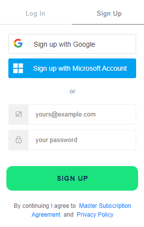
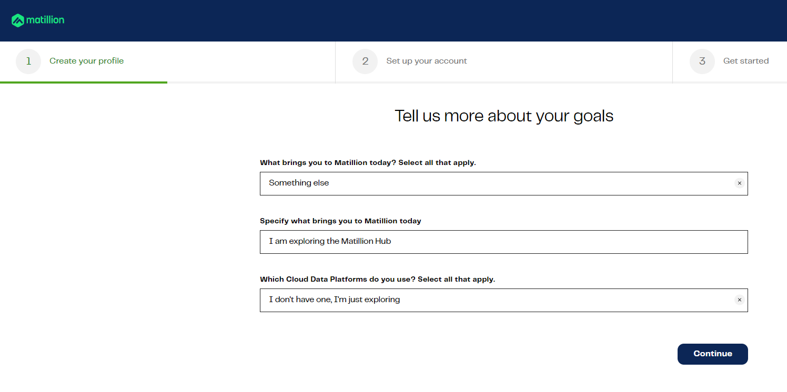
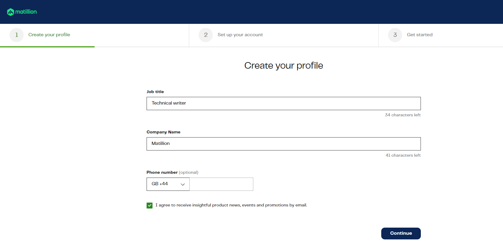
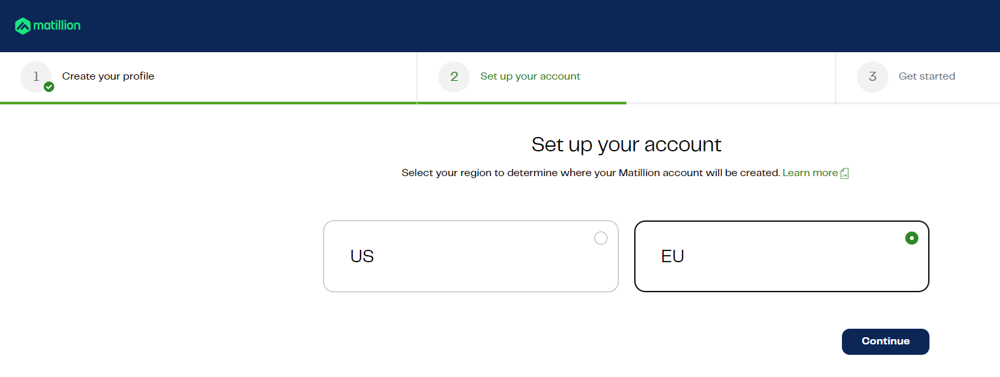
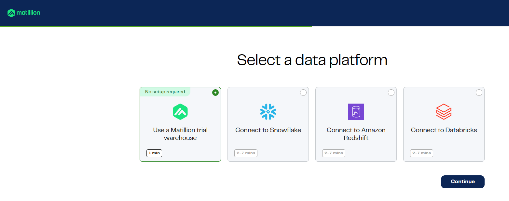

# Matillion: How-to Guide

## How to create an account with Matillion

This guide shows you how to create an account with Matillion.

1. **Registering on the Matillion Hub**
   
To access the services offered by the Matillion Hub, individuals interested in becoming users must complete the registration process.
> This section provides instructions for new customers on how to register for a Hub account.

Follow these steps to register for a Hub account:

-   Access the [Matillion Hub](https://hub.matillion.com), and click the **Sign Up** tab.
  
<kbd></kbd>

-   Enter your company email address and choose a password, then click **SIGN UP**.
> **Note:** When registering with the Hub, use your company email address; personal email addresses are not allowed for registration.
-   Alternatively, you can sign in with your existing third-party identity provider. Click the relevant button for your provider.

2. **Verifying your email address**
  
Follow these steps to verify your email address and to activate your account:

-   After registration using a password, follow the email verification process. Verify your email by following the prompts in the email you receive.
-   Return to the Hub and log in using your credentials.

> **Note:** If you have used a third-party identity provider, you can proceed directly to ''Creating your profile'' section without needing to provide an email.

3. **Creating your profile**

Follow these steps to create your profile:
-   After you have logged in, answer some basic questions about your
    purpose to sign up with the Matillion Hub.
-   Click **Continue**.
  
<kbd></kbd>
-   Enter the details requested and a phone number (optional) on the
    **Create your profile** page.
-   Check the box to accept the **Master Subscription Agreement** and **Privacy Policy**.
-   Click **Continue**.

<kbd></kbd>

4. **Setting up your account**

Follow these steps to set up your profile:

-   After you have created your profile, select the region for your Matillion account.
-   Click **Continue**.
  
<kbd></kbd>

5. **Getting started by selecting a data platform**

Follow these steps to get started:
-   After you have set up your account, select **Matillion Trial Warehouse** from available data platforms.
-   Click **Continue**.

<kbd></kbd>

**Support information**

For any help, contact the Matillion support team:
- Email: info@matillion.com
- Phone: +44-1565-759884
- Website: www.matillion.com
- Web support: https://support.matillion.com

**Useful resources**

| Topic name | Links |
| ------ | ------ |
| Getting started | <https://docs.matillion.com/data-productivity-cloud/hub/docs/hub-getting-started/> |
| Multi-factor authentication| <https://docs.matillion.com/data-productivity-cloud/hub/docs/multi-factor-authentication/> |
| Data Productivity Cloud | <https://docs.matillion.com/data-productivity-cloud/data-productivity-cloud-overview/> |
| Matillion ETL product overview | <https://docs.matillion.com/metl/docs/1975061/> |
| Data Loader overview | <https://docs.matillion.com/data-productivity-cloud/hub/docs/matillion-data-loader-overview/> |
